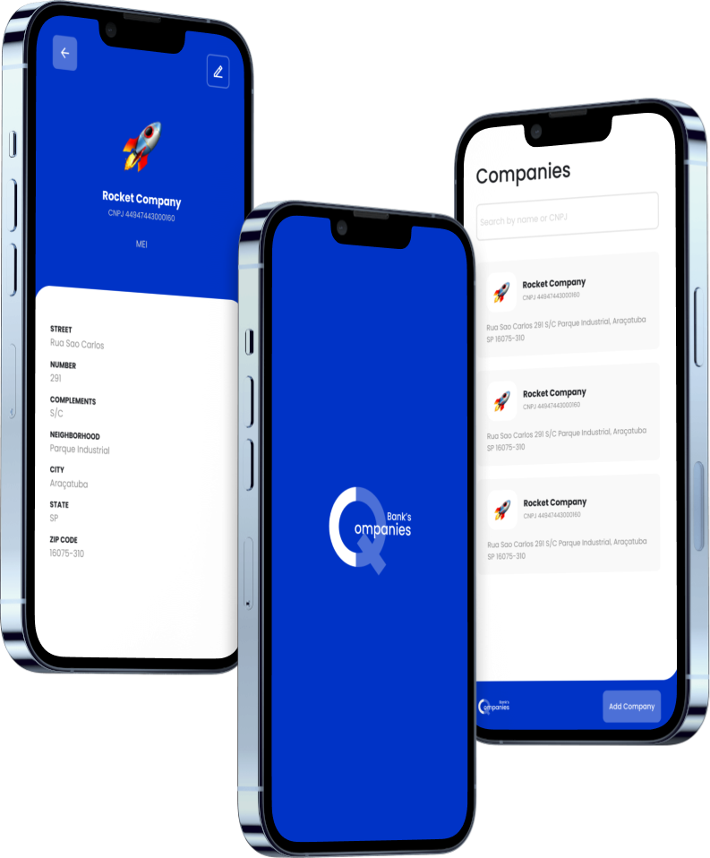

<div align="center">
  
  <p>A React Native app to store company data</p>
</div>

<br />
<br />

<div align="center">
  

  Access figma by [clicking here](https://www.figma.com/file/bx1k4Be3pSJxPbWqIUqeJ4/QBank's-Companies?node-id=7%3A370)
</div>


## Tools and Libraries
- React Native
- Styled Components
- Typescript
- React Navigation
- React Hook Form
- Axios
- Yup
- Prettier
- Eslint
- React Native CLI
- git-flow

## Install dependencies
```bash
yarn #or npm install
```

## Running on an emulator
Follow the [instructions](https://reactnative.dev/docs/next/environment-setup) in the RN documentation (CLI) to set up the environment. After that, run the command:

```bash
yarn android #ios not tested
#or npm run android
```

then run the command:
```bash
yarn start #or npm start
```


## Running On Device
- Plug in your device via USB
- Follow the [instructions](https://reactnative.dev/docs/next/running-on-device#2-plug-in-your-device-via-usb) in the RN documentation (CLI) to set up the environment. After that, run the command:

```bash
yarn android #ios not tested
#or npm run android
```

then run the command:
```bash
yarn start #or npm start
```